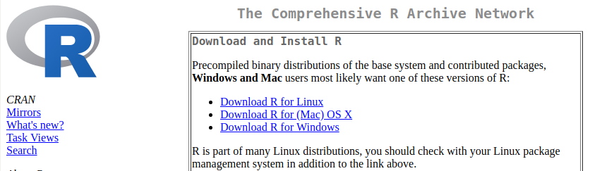
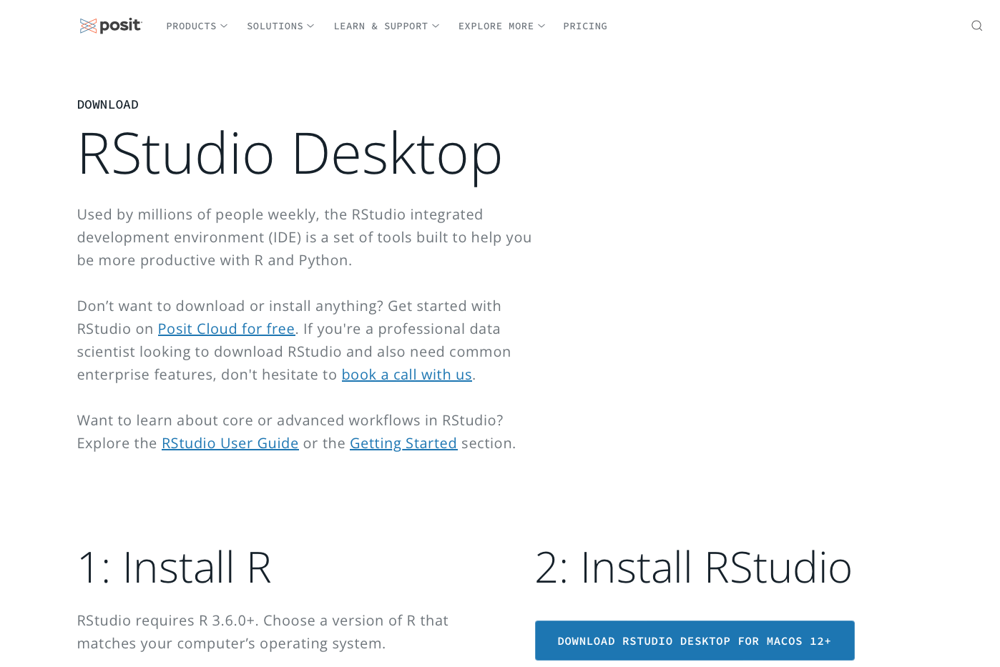
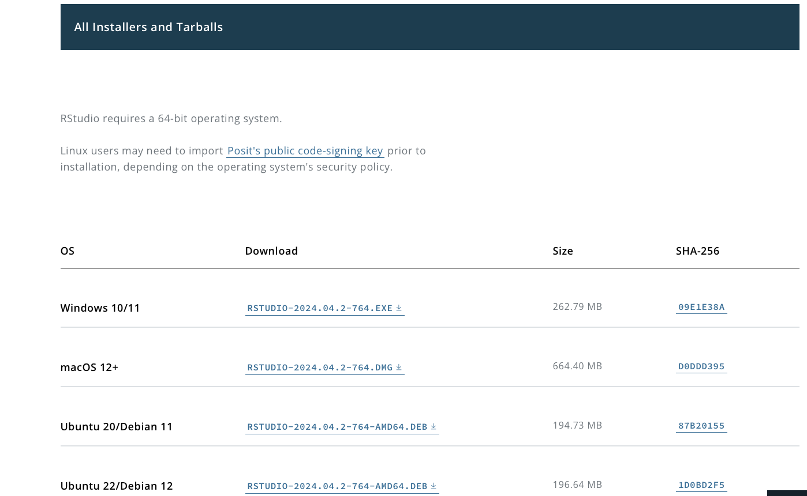
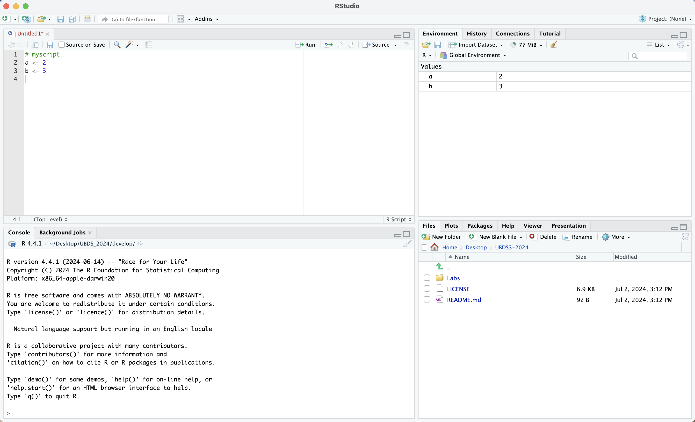

```{r setup, include=FALSE}
knitr::opts_chunk$set(echo = TRUE)
```

# R and RStudio

This lab will help you prepare your computer environment for the
practical component of the course. You will learn how to install or update
R and RStudio, as well as how to obtain R-packages necessary for the course, and makes sure you
have right versions of the software. 

**If you encounter any issue, please don't hesitate to ask the the teachers for assistance.**

## Getting R

  + **R is a free software** available for download from
[CRAN](https://cran.rstudio.com/), the Comprehensive R Archive Network.
<br/>The latest release of R is 4.4.1, *Race for Your Life* (released on
2024/06/14).
  
  + To install or update R **go to <https://cran.rstudio.com/> and download** the
precompiled binary distribution for your operating system. The links
for Linux/Mac/Windows appear on the top of the website, as shown in the
image below. <br>After downloading the appropriate file, open it and
**follow the instructions to complete the installation.** <br><br>

 <br><br>

## Getting RStudio

  + **RStudio is an IDE** (Integrated Development Environment) for R. It
provides you with a powerful interface for working with R, which
includes a **text editor** where you can write your code and/or notes.

  + **To get RStudio** go to
<https://posit.co/download/rstudio-desktop/#download> and download a
free version by clicking the blue button 'DOWNLOAD RSTUDIO DESKTOP'. 
Open the file and follow the instructions. <br><br>
If you don't see the appropriate 
version for your OS, you can scroll down to find it <br><br>


<br>


## Getting started
  
  + **Rstudio interface**: <br>
  open Rstudio, in the default setting the interface has 4 panels:
      
      + top-left: scripts and files
      + bottom-left: R console
      + top-right: objects, history and environment
      + bottom-right: tree of folders(files), graph window(plots), packages, help window, viewer<br>
      
      Don't worry, we will get familiar with this in the course! 



To test whether the installation of R and RStudio was successful, type in a simple arithmetic calculation in the Console panel (bottom left)
e.g.:

```{r, eval = FALSE}
1+1
2^3
```

to see if the commands execute and the results are correct.
<br><br>


### Installing packages
Please install these packages that you are going to need in the following days:<br>
For this you have to copy and execute the following code chunks (one after another) in the R console. 

Install `Bioconductor`
```{r, eval=F}
if (!require("BiocManager", quietly = TRUE))
  install.packages("BiocManager")
BiocManager::install(version = "3.19")

```

After we installed Bioconductor, we can install `tidyverse` and `patchwork`. 

```{r, eval=F}
BiocManager::install("tidyverse", dependencies = TRUE)
```

```{r, eval=F}
BiocManager::install("patchwork", dependencies = TRUE)
```

### Check Package installation 
To check if the packages have been installed successfully and are working correctly, you can load them. 

```{r, eval=F}

library(tidyverse)
library(patchwork)

```

If you don't get an error message, all is set and we are good to go! <br>
<br>
**See you in the course & dont hesitate to contact us, if you have any doubts!** <br>
<br>
Leone & Julia 
